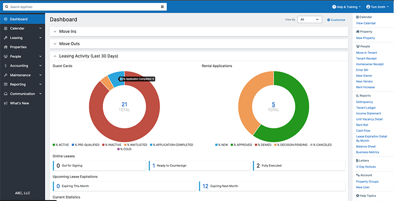
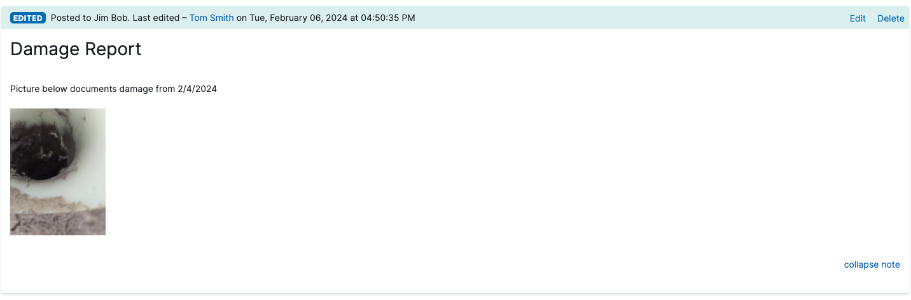

# AppFolio Addons - Chrome Extension

[Chrome Web Store](https://chromewebstore.google.com/detail/appfolio-addons/nenehgaifcbdcbpikefdehbggokeodim)

### Features
1. UI Cleanup
2. Markdown Support for Notes

#### UI Cleanup
1. Increases width of main container to leverage space on wide screens.
2. Hides a number of elements, including support chat, advertisements for upgrades, signals, and another annoying things. 
3. Changes the link for Rental Applications on Dashboard from the report to the applications page.
4. Add Hyperlink to Payee Name on Bill Detail pages.

Here is a screenshot of the Dashboard

#### Mark Down for Notes
Enhances notes section in AppFolio to support markdown

[Markdown Guide](https://www.markdownguide.org/)

Here is screenshot of Notes with Markdown

#### This is a work in progress and more features will come...

#### If you have issues please open an issue on GitHub or email us at admin@alloylab.com